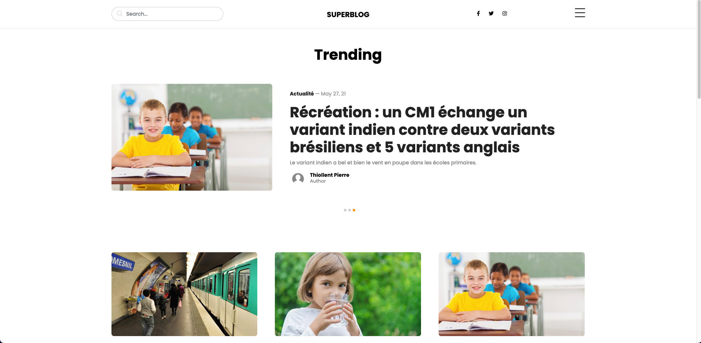

# Blog PHP

Blog developed in PHP from scratch, using OOP and MVC model. This project is carried out as part of my course PHP / Symfony Application Developer at OpenClassroom



## Requirements 🔧

| Dependency | Version |
| ---------- | :-----: |
| PHP        | >= 8.0  |
| Composer   |         |

## Run Locally

Clone the project

```shell
  git clone https://github.com/PierreThiollent/Blog-PHP
```

Go to the project directory

```shell
  cd blog-php
```

Install dependencies

```shell
  composer install
```

## Configuration

In the project folder execute this command

```shell
cp .env .env.local
```

Then fill the env vars into .env.local

```env
  DB_HOST="dbhost"
  DB_USERNAME="dbuser"
  DB_PASSWORD="dbpassword"
  DB_NAME="dbname"
  DB_PORT="dbport"
  DB_CHARSET="dbcharset"
  env="dev"
```
